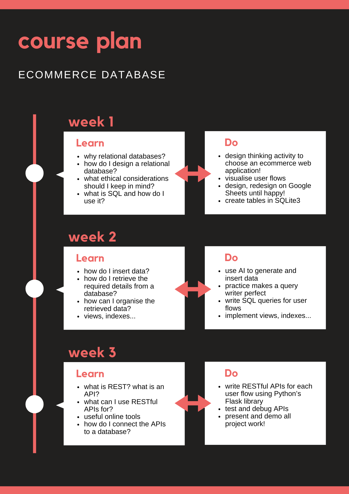

# Databases and SQL
## Course Overview
This is the introductory course to Databases and SQL, where you will learn about relational databases, database design, SQL, and REST API integration. By the end of this course, you will have created a fully functional database for an ecommerce web application of your choice!

### Modules
1. **Introduction and Designing Relational Databases**
Learn the fundamental concepts of relational databases and how to design a database following the best practices used in industry.

2. **Data and Ecommerce Ethics**
Explore ethical considerations in data management, like privacy and security in ecommerce applications.

3. **SQL**
Develop your SQL skills by creating tables, inserting data, and writing queries. Further, some advanced topics like views and indexes will be included.

4. **Introduction to REST APIs**
Get an introduction to RESTful APIs and learn how to use Python's Flask library to create basic APIs that interact with your database.

## Course Plan
Here is the course plan broken down week by week, so you get an idea of what to expect.

## Assessment
Here is a break-down of how your learning will be assessed during this course.
1. Quiz (40 marks)
2. Mock Interviews (40 marks)
    1. Mini-project Viva: Here, you will complete a mini-project related to SQL queries. Once completed, viva will be conducted to assess your understanding and application of database querying to the mini-project. 
    2. LeetCode Mock Interview: In a format similar to coding interviews you may give in the future, you will be assigned five SQL problems to solve on LeetCode. After the given time, you will be asked to walk through your thought process for each problem.

This is the place where the codealong code, assignments and sample project live! You should "clone" this GitHub repository into your own account. Then, open a CodeSpace to start working with these files directly.

## SQLite3 Tips
### SQLite Viewer
* This extension helps you view, filter and sort the data in an SQL database in a format similar to Google Sheets. This is helpful if you want to check the results of your queries.
### Working with SQLite3 in the Terminal
* `sqlite3 [dbname].db` to enter the SQLite3 shell. If the database doesn't exist already, it creates a new one.
* `.schema` displays the schema of the database.
* `.quit` to exit the shell.
* If you want to run an SQL file without entering the shell, then run `sqlite3 [dbname].db < [filename].sql`.

## How to GitHub
* [A beginner’s guide to learning to code with GitHub Codespaces](https://github.blog/developer-skills/github/a-beginners-guide-to-learning-to-code-with-github-codespaces/)
* [Quickstart for GitHub Codespaces](https://docs.github.com/en/codespaces/getting-started/quickstart)
* [git - the simple guide](https://rogerdudler.github.io/git-guide/)
* Here is a very comprehensive guide if you need it: [GitHub Skills](https://skills.github.com/)
